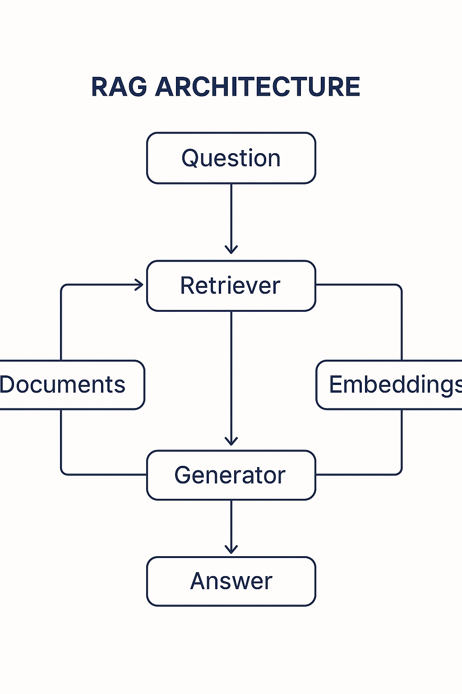
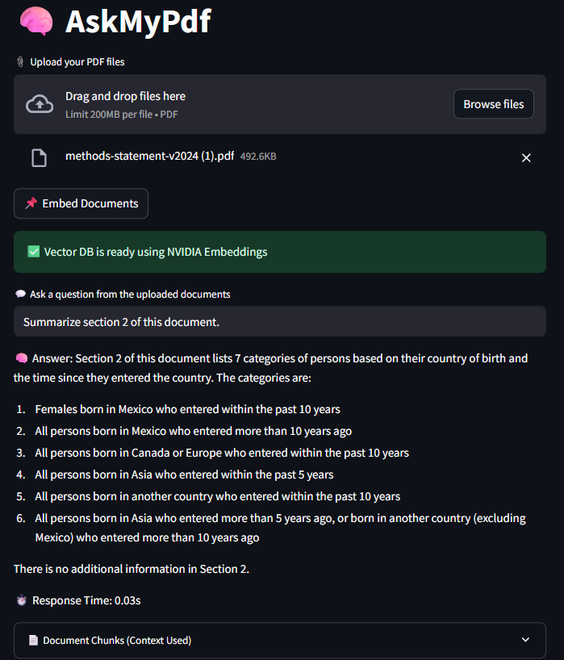

# 🧠 AI-Powered Document Q&A using NVIDIA NIM + Streamlit

Welcome to my project — a lightweight, fast, and powerful **Question-Answering system** built with **NVIDIA NIM**, **LangChain**, and **Streamlit**. This app allows users to **upload PDFs**, semantically **search content**, and interact with documents via natural language queries. The backend uses **FAISS vector stores** and **NVIDIA’s LLMs** via API for real-time insights.

---

## 📌 What This Project Demonstrates

✅ Integration of **NVIDIA's LLM APIs** using `langchain-nvidia-ai-endpoints`  
✅ Use of **LangChain RAG architecture** with custom PDF loaders  
✅ Real-time **semantic search** using **FAISS** and **NVIDIAEmbeddings**  
✅ Clean Streamlit UI with file upload and live question-answering  
✅ Secure key handling for deployment (via `st.secrets`)  
✅ Built for production-like workflows with modular, testable code  

---

## 🔍 Use Case

Imagine uploading policy documents, healthcare reports, legal files, or research papers — and asking natural language questions like:

> "What are the key findings?"  
> "When was the last census update mentioned?"  
> "Summarize section 2 of this document."

The app retrieves relevant document chunks and responds using NVIDIA’s LLM, trained for contextual understanding.

---

## 🛠️ Tech Stack

| Layer          | Tech Used                                |
|----------------|-------------------------------------------|
| Frontend       | Streamlit                                |
| LLM Backend    | NVIDIA NeMo Inference Microservices (NIM) |
| RAG Pipeline   | LangChain + FAISS                        |
| Data Input     | PyPDF Loader                             |
| Security       | Streamlit Secrets Manager                |

---

## ⚙️ RAG Architecture

This app follows a **Retrieval-Augmented Generation (RAG)** architecture:

---
## ⚙️ User Interface

---
